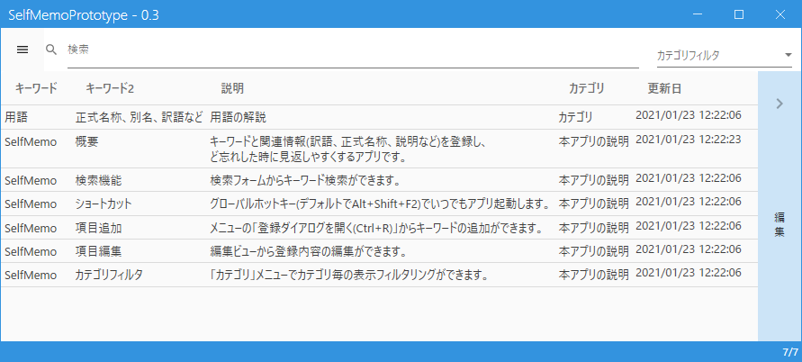
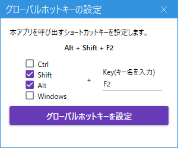
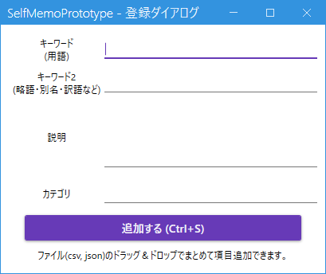
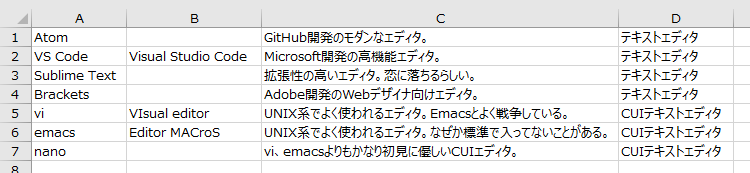
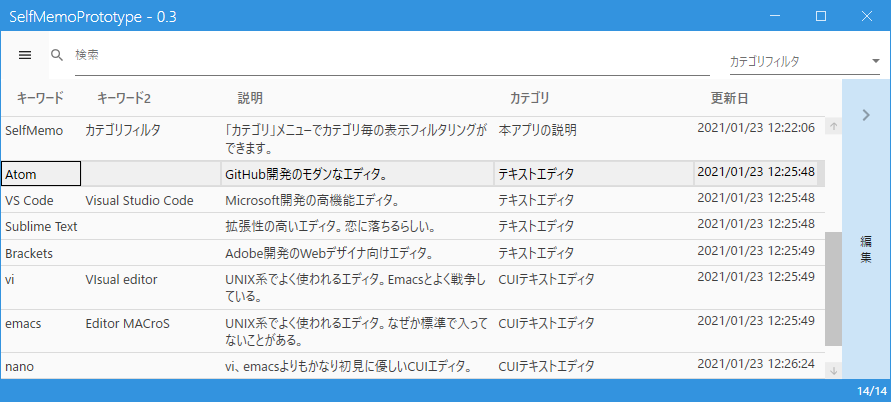
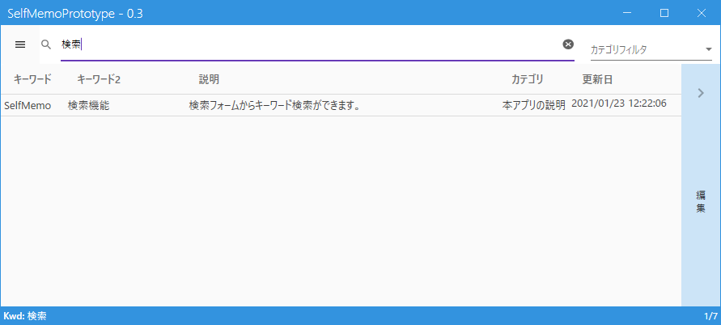
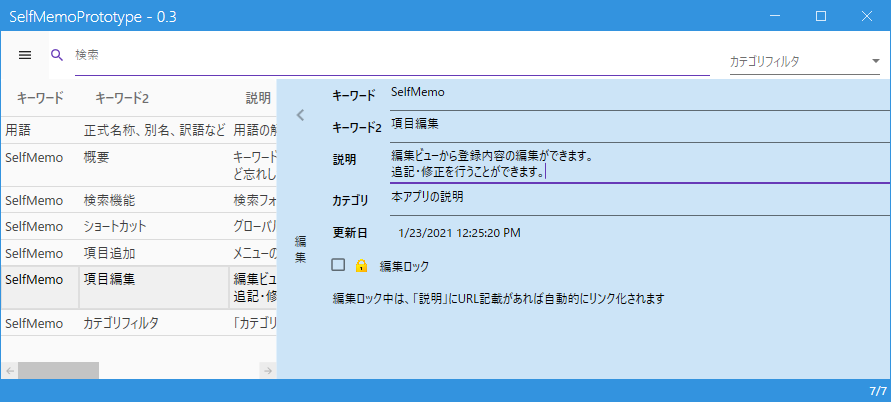

# SelfMemoPrototype

たまに使うけど忘れがちな用語、言い回しなどを記録しておき、忘れたときに素早く調べるための個人メモツールです。

## 特徴

- いつでもショートカットキーで一発起動
- 覚えておきたい用語はシンプルなフォームで追加
- 全文字列を対象にリアルタイム検索

「この言葉、毎回検索してるけど全然覚えられない…」というとき、検索した内容を本ツールにメモっておき、次回以降は本ツール上で検索することで時短につなげる、といった使用方法を想定しています。
単語帳や備忘録、セルフ辞書ツールなどとしても使えるかと思います。

### 最新バージョンの入手

[こちら](https://github.com/ogsoonyn/SelfMemoPrototype/releases)から。

## 使い方

### 起動

実行すると常駐します。
ショートカット（デフォルトではAlt+Shift+F2）で起動します。
起動するショートカットキーは、メニューの「グローバルホットキーの設定」から変更可能です。

### 用語登録

まずは覚えておきたい用語やメモなどを登録します。
メニューの「登録ダイアログを開く (Ctrl+R) 」から用語を追加できます。

#### ダイアログに入力して登録

- 「キーワード」にメインとなるキーワード
- 「キーワード2」 に補助的なひとこと説明（空白でもOK）
- 「説明」にキーワードの内容説明やメモ本文
- 「カテゴリ」に自分でわかりやすい分類名

のような形で登録すると良いかと思います。

#### ファイルから登録する

csvファイルを読み込んで登録することも可能です。
下記のようなフォーマットでcsvを作成し、ドラッグ&ドロップすれば一括登録されます。

これをドラッグ&ドロップすると、下図のように追加されます。

### 検索

検索フォームに入力すると、リストの内容を検索し、検索ワードを含む項目のみを表示します。
スペース区切りでAND検索可能です。

カテゴリフィルタを設定すると、指定したカテゴリの項目のみを表示します。

### 登録済みデータの編集

ウィンドウ右の「編集」バーをクリックすると編集エリアが表示されます。
編集エリアでは、登録済みのデータを書き換えることができます。

「説明」にURLが含まれる項目の場合、「編集ロック」をかけるとURLがリンク化されます。

## 利用例

- 「キーワード」に日本語、「説明」に英文や英単語を入力し、英作文でよく使う言い回しリストにする
- 「キーワード」に英単語、「キーワード2」に日本語訳、「説明」に用例を入力し、マイ英単語帳にする
- 「キーワード」に略語、「キーワード2」に正式名称、「説明」に詳細を入力し、略語解説リストにする

など？

## Thanks

タスクトレイ常駐、グローバルホットキーの実装は下記記事を参考に（丸パクリ）させていただきました。

- [WPF用にNotifyIconクラスをラップしてみた](http://sourcechord.hatenablog.com/entry/2017/02/11/125649)
- [WPFでホットキーの登録](http://sourcechord.hatenablog.com/entry/2017/02/13/005456)
